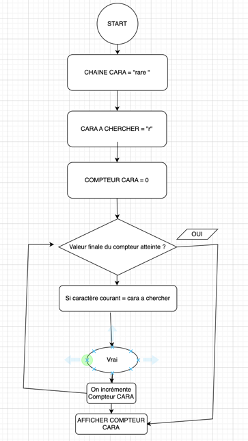

# tp_assembleur


1.	Vérifions cela avec un premier programme simple

Mon code :
```assembly
.ORIG x3000 ; Votre code après ce commentaire
AND R0, R0, #0 ; init registre pour résultat
LD R2, VALEUR1 ; charger valeur 1 dans R2
LD R3, VALEUR2 ; charger valeur 2 dans R3
LOOP ADD R0, R0, R2 ; Début de la boucle
ADD R3, R3, #-1 ; Décrémentation
BRP LOOP ; pour revenir au label
ST R0, RESULTAT ; envoi de R0 vers RESULTAT
VALEUR1 .FILL #10 ; Première valeur
VALEUR2 .FILL #5 ; Deuxième valeur
RESULTAT .FILL #0 ; Espace mémoire pour le résultat
.END
```


2.	Un peu plus complexe maintenant
a.

Mon code :
```python
g_tc_chaineDeCara="Lorem ipsum dolor sit amet, " \
"consectetur adipiscing elit, " \
"sed do eiusmod tempor incididunt " \
"ut labore et dolore magna aliqua."
g_c_caraACompter = "r"
nb_caractere=0

for c in g_tc_chaineDeCara :
    if c==g_c_caraACompter :
        nb_caractere+=1
print(nb_caractere)
```


b.	Représentation universelle



c. Représentation LC3

Mon code :
```assembly
.ORIG x3000
LEA R0,LOREM; Chargement dans RO de l’adresse de la chaîne
LD R1,CHAR; Chargement dans R1 du code ASCII de ’l’
AND R2,R2,#0 ; Mise à 0 du compteur
NOT R1,R1 ; Calcul de l’opposé de R1
ADD R1,R1,#1 ; R1 = -R1
loop LDR R3,R0,#0 ; Chargement dans R3 du caractère pointé par R0
BRz fini ; Test de fin de chaîne 
ADD R3,R3,R1 ; Comparaison avec ’l’
BRnp suite ; Non égalité
ADD R2,R2,#1 ; Incrémentation du compteursuite 
ADD R0,R0,#1 ; Incrémentation du pointeur
BR loop
fini HALT
CHAR .STRINGZ "r" ; caractère dont on souhaite compter le nombre d'itérations
LOREM .STRINGZ "Lorem ipsum dolor sit amet, consectetur adipiscing elit, sed do eiusmod tempor incididunt ut labore et dolore magna aliqua." ; Chaine de caractère dans laquelle on souhaite compter les itérations
LEN .FILL #123 ; taille de la chaine de caractère
CMPT .FILL #0 ; espace mémoire pour stocker le résultat
.END
```

BONUS 1

Mon code :
```assembly
.orig x3000	
AND R2, R2, #0; Caractère de la chaine qui va être comparé 
AND R3, R3, #0; Compteur d'occurence
LD R4, CHAR
LEA R0, LOREM
LOOP LDR R2, R0, #0
ADD R0, R0, #1
NOT R1, R2
ADD R1, R1, #1
ADD R1, R1, R4
BRNP NO_INCR
ADD R3, R3,  #1
NO_INCR	ST R0, VERIF
LDR R6, R0, #0 ; Si LDR est vide on quitte le prog 
BRZ FIN
BRNZP LOOP
FIN	ST R3, CMPT
CHAR .STRINGZ "r" ; caractère dont on souhaite compter le nombre d'itératio
LOREM .STRINGZ "Lorem ipsum dolor sit amet, consectetur adipiscing elit, sed do eiusmod tempor incididunt ut labore et dolore magna aliqua."
CMPT .FILL #0 ; espace mémoire pour stocker le résultat
VERIF .FILL #0 ; verif si on a fini le tableau
HALT
.END
```

BONUS 2
```assembly
.orig x3000
LD R4, CHAR
LEA R0, LOREM	
LOOP AND R2, R2, #0
LDR R2, R0, #0
ADD R0, R0, #1
NOT R1, R2
ADD R1, R1, #1
AND R2, R2, #0
LD R2, TMP1
ADD R1, R1, R4
BRNP NO_INCR
ADD R2, R2,  #1
NO_INCR	ST R0, VERIF
ST R2, TMP1
AND R2, R2, #0
LDR R2, R0, #0
BRZ FIN
BRNZP LOOP
FIN	AND R2, R2, #0
LD R2, TMP1
ST R2, CMPT
CHAR .STRINGZ "r" ; caractère dont on souhaite compter le nombre d'itératio
LOREM .STRINGZ "Lorem ipsum dolor sit amet, consectetur adipiscing elit, sed do eiusmod tempor incididunt ut labore et dolore magna aliqua."
CMPT .FILL #0 ; espace mémoire pour stocker le résultat
VERIF .FILL #0 ; verif si on a fini le tableau
TMP1 .FILL #0 ; variable temporaire pour stocker les registres
HALT
.END
```